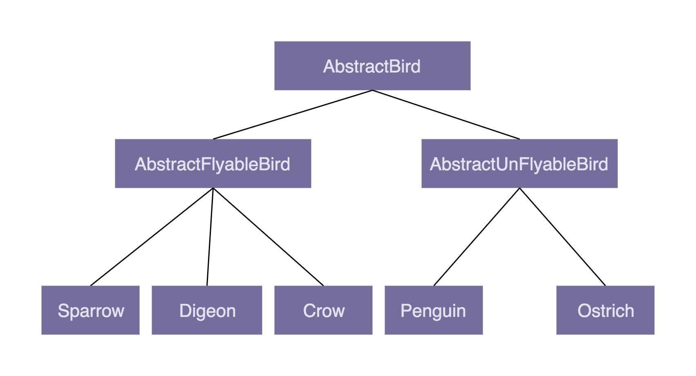

1. 关于封装特性封装也叫作信息隐藏或者数据访问保护。类通过暴露有限的访问接口，授权外部仅能通过类提供的方式来访问内部信息或者数据。它需要编程语言提供权限访问控制语法来支持，例如 Java 中的 private、protected、public 关键字。封装特性存在的意义，一方面是保护数据不被随意修改，提高代码的可维护性；另一方面是仅暴露有限的必要接口，提高类的易用性。

2. 关于抽象特性封装主要讲如何隐藏信息、保护数据，那抽象就是讲如何隐藏方法的具体实现，让使用者只需要关心方法提供了哪些功能，不需要知道这些功能是如何实现的。抽象可以通过接口类或者抽象类来实现，但也并不需要特殊的语法机制来支持。抽象存在的意义，一方面是提高代码的可扩展性、维护性，修改实现不需要改变定义，减少代码的改动范围；另一方面，它也是处理复杂系统的有效手段，能有效地过滤掉不必要关注的信息。

3. 关于继承特性继承是用来表示类之间的 is-a 关系，分为两种模式：单继承和多继承。单继承表示一个子类只继承一个父类，多继承表示一个子类可以继承多个父类。为了实现继承这个特性，编程语言需要提供特殊的语法机制来支持。继承主要是用来解决代码复用的问题。

4. 关于多态特性多态是指子类可以替换父类，在实际的代码运行过程中，调用子类的方法实现。多态这种特性也需要编程语言提供特殊的语法机制来实现，比如继承、接口类、duck-typing。多态可以提高代码的扩展性和复用性，是很多设计模式、设计原则、编程技巧的代码实现基础。

# 比较继承组合

## 继承

> 装饰者模式（decorator pattern）、策略模式（strategy pattern）、组合模式（composite pattern）等都使用了组合关系，而模板模式（template pattern）使用了继承关系。

> 表示类之间的 is-a 关系，可以解决代码复用的问题
>
> 虽然继承有诸多作用，但继承层次过深、过复杂，也会影响到代码的可维护性

1. 

```java
/*
对于这些不会飞的鸟来说，我们都需要重写 fly() 方法，抛出异常。这样的设计，一方面，徒增了编码的工作量；另一方面，也违背了我们之后要讲的最小知识原则（Least Knowledge Principle，也叫最少知识原则或者迪米特法则），暴露不该暴露的接口给外部，增加了类使用过程中被误用的概率。
*/
public class AbstractBird {
  //...省略其他属性和方法...
  public void fly() { //... }
}

public class Ostrich extends AbstractBird { //鸵鸟
  //...省略其他属性和方法...
  public void fly() {
    throw new UnSupportedMethodException("I can't fly.'");
  }
}
```

2. 那我们再通过 AbstractBird 类派生出两个更加细分的抽象类

- 继承层次过深、继承关系过于复杂会影响到代码的可读性和可维护性。




## 组合

>  组合（composition）、接口、委托（delegation）

```java
/*
接口只声明方法，不定义实现。也就是说，每个会下蛋的鸟都要实现一遍 layEgg() 方法，并且实现逻辑是一样的，这就会导致代码重复的问题。
*/
public interface Flyable {
  void fly();
}
public interface Tweetable {
  // 会叫
  void tweet();
}
public interface EggLayable {
  void layEgg();
}
public class Ostrich implements Tweetable, EggLayable {//鸵鸟
  //... 省略其他属性和方法...
  @Override
  public void tweet() { //... }
  @Override
  public void layEgg() { //... }
}
public class Sparrow impelents Flayable, Tweetable, EggLayable {//麻雀
  //... 省略其他属性和方法...
  @Override
  public void fly() { //... }
  @Override
  public void tweet() { //... }
  @Override
  public void layEgg() { //... }
}
```

```java
// 通过组合和委托技术来消除代码重复
public interface Flyable {
  void fly()；
}
public class FlyAbility implements Flyable {
  @Override
  public void fly() { //... }
}
//省略Tweetable/TweetAbility/EggLayable/EggLayAbility

public class Ostrich implements Tweetable, EggLayable {//鸵鸟
  private TweetAbility tweetAbility = new TweetAbility(); //组合
  private EggLayAbility eggLayAbility = new EggLayAbility(); //组合
  //... 省略其他属性和方法...
  @Override
  public void tweet() {
    tweetAbility.tweet(); // 委托
  }
  @Override
  public void layEgg() {
    eggLayAbility.layEgg(); // 委托
  }
}
```

## 选择举例

1. A 类和 B 类并不一定具有继承关系

比如，Crawler 类和 PageAnalyzer 类，它们都用到了 URL 拼接和分割的功能，但并不具有继承关系（既不是父子关系，也不是兄弟关系）。仅仅为了代码复用，生硬地抽象出一个父类出来，会影响到代码的可读性。

```java
// 正确写法如下
public class Url {
  //...省略属性和方法
}

public class Crawler {
  private Url url; // 组合
  public Crawler() {
    this.url = new Url();
  }
  //...
}

public class PageAnalyzer {
  private Url url; // 组合
  public PageAnalyzer() {
    this.url = new Url();
  }
  //..
}
```

2. 还有一些特殊的场景要求我们必须使用继承。

   如果你不能改变一个函数的入参类型，而入参又非接口，为了支持多态，只能采用继承来实现。比如下面这样一段代码，其中 FeignClient 是一个外部类，我们没有权限去修改这部分代码，但是我们希望能重写这个类在运行时执行的 encode() 函数。这个时候，我们只能采用继承来实现了

```java

public class FeignClient { // feighn client框架代码
  //...省略其他代码...
  public void encode(String url) { //... }
}

public void demofunction(FeignClient feignClient) {
  //...
  feignClient.encode(url);
  //...
}

public class CustomizedFeignClient extends FeignClient {
  @Override
  public void encode(String url) { //...重写encode的实现...}
}

// 调用
FeignClient client = new CustomizedFeignClient();
demofunction(client);
```

## summary

1. 为什么不推荐使用继承？

   继承是面向对象的四大特性之一，用来表示类之间的 is-a 关系，可以解决代码复用的问题。虽然继承有诸多作用，但继承层次过深、过复杂，也会影响到代码的可维护性。在这种情况下，我们应该尽量少用，甚至不用继承。

2.  组合相比继承有哪些优势？

   继承主要有三个作用：表示 is-a 关系，支持多态特性，代码复用。而这三个作用都可以通过组合、接口、委托三个技术手段来达成。除此之外，利用组合还能解决层次过深、过复杂的继承关系影响代码可维护性的问题。

3. 如何判断该用组合还是继承？

   尽管我们鼓励多用组合少用继承，但组合也并不是完美的，继承也并非一无是处。在实际的项目开发中，我们还是要根据具体的情况，来选择该用继承还是组合。如果类之间的继承结构稳定，层次比较浅，关系不复杂，我们就可以大胆地使用继承。反之，我们就尽量使用组合来替代继承。除此之外，还有一些设计模式、特殊的应用场景，会固定使用继承或者组合

# 封装

1. 而面向对象封装的定义是：通过访问权限控制，隐藏内部数据，外部仅能通过类提供的有限的接口访问、修改内部数据。所以，暴露不应该暴露的 setter 方法，明显违反了面向对象的封装特性。数据没有访问权限控制，任何代码都可以随意修改它，代码就退化成了面向过程编程风格的了。

2. 滥用全局变量和全局方法
在定义 Utils 类之前，你要问一下自己，你真的需要单独定义这样一个 Utils 类吗？是否可以把 Utils 类中的某些方法定义到其他类中呢？如果在回答完这些问题之后，你还是觉得确实有必要去定义这样一个 Utils 类，那就大胆地去定义它吧。因为即便在面向对象编程中，我们也并不是完全排斥面向过程风格的代码。只要它能为我们写出好的代码贡献力量，我们就可以适度地去使用。除此之外，类比 Constants 类的设计，我们设计 Utils 类的时候，最好也能细化一下，针对不同的功能，设计不同的 Utils 类，比如 FileUtils、IOUtils、StringUtils、UrlUtils 等，不要设计一个过于大而全的 Utils 类。

## summary
1. 滥用 getter、setter 方法在设计实现类的时候，除非真的需要，否则尽量不要给属性定义 setter 方法。除此之外，尽管 getter 方法相对 setter 方法要安全些，但是如果返回的是集合容器，那也要防范集合内部数据被修改的风险。

2.Constants 类、Utils 类的设计问题对于这两种类的设计，我们尽量能做到职责单一，定义一些细化的小类，比如 RedisConstants、FileUtils，而不是定义一个大而全的 Constants 类、Utils 类。除此之外，如果能将这些类中的属性和方法，划分归并到其他业务类中，那是最好不过的了，能极大地提高类的内聚性和代码的可复用性。

3. 基于贫血模型的开发模式关于这一部分，我们只讲了为什么这种开发模式是彻彻底底的面向过程编程风格的。这是因为数据和操作是分开定义在 VO/BO/Entity 和 Controler/Service/Repository 中的。今天，你只需要掌握这一点就可以了。为什么这种开发模式如此流行？如何规避面向过程编程的弊端？有没有更好的可替代的开发模式？相关的更多问题，我们在面向对象实战篇中会一一讲解。

## why operate dev use C
使用任何一个编程语言编写的程序，最终执行上都要落实到CPU一条一条指令的执行（无论通过虚拟机解释执行，还是直接编译为机器码），CPU看不到是使用何种语言编写的程序。对于所有编程语言最终目的是两种：提高硬件的运行效率和提高程序员的开发效率。然而这两种很难兼得。
C语言在效率方面几乎做到了极致，它更适合挖掘硬件的价值，如：C语言用数组char a[8]，经过编译以后变成了（基地址＋偏移量）的方式。对于CPU来说，没有运算比加法更快，它的执行效率的算法复杂度是O(1)的。从执行效率这个方面看，开发操作系统和贴近硬件的底层程序，C语言是极好的选择。
C语言带来的问题是内存越界、野指针、内存泄露等。它只关心程序飞的高不高，不关心程序猿飞的累不累。为了解脱程序员，提高开发效率，设计了OOP等更“智能”的编程语言，但是开发容易毕竟来源于对底层的一层一层又一层的包装。完成一个特定操作有了更多的中间环节, 占用了更大的内存空间, 占用了更多的CPU运算。从这个角度看，OOP这种高级语言的流行是因为硬件越来越便宜了。我们可以想象如果大众消费级的主控芯片仍然是单核600MHz为主流，运行Android系统点击一个界面需要2秒才能响应，那我们现在用的大部分手机程序绝对不是使用JAVA开发的，Android操作系统也不可能建立起这么大的生态。

## 接口和抽象类
### 接口
- 接口不能包含属性（也就是成员变量）。
- 接口只能声明方法，方法不能包含代码实现。
- 类实现接口的时候，必须实现接口中声明的所有方法

### 抽象类

- 抽象类不允许被实例化，只能被继承。也就是说，你不能 new 一个抽象类的对象出来（Logger logger = new Logger(…); 会报编译错误）。
- 抽象类可以包含属性和方法。方法既可以包含代码实现（比如 Logger 中的 log() 方法），也可以不包含代码实现（比如 Logger 中的 doLog() 方法）。不包含代码实现的方法叫作抽象方法。
- 子类继承抽象类，必须实现抽象类中的所有抽象方法。对应到例子代码中就是，所有继承 Logger 抽象类的子类，都必须重写 doLog() 方法。


### summary
1. 抽象类和接口的语法特性抽象类不允许被实例化，只能被继承。它可以包含属性和方法。方法既可以包含代码实现，也可以不包含代码实现。不包含代码实现的方法叫作抽象方法。子类继承抽象类，必须实现抽象类中的所有抽象方法。接口不能包含属性，只能声明方法，方法不能包含代码实现。类实现接口的时候，必须实现接口中声明的所有方法。

2. 抽象类和接口存在的意义抽象类是对成员变量和方法的抽象，是一种 is-a 关系，是为了解决代码复用问题。接口仅仅是对方法的抽象，是一种 has-a 关系，表示具有某一组行为特性，是为了解决解耦问题，隔离接口和具体的实现，提高代码的扩展性。

3. 抽象类和接口的应用场景区别什么时候该用抽象类？什么时候该用接口？实际上，判断的标准很简单。如果要表示一种 is-a 的关系，并且是为了解决代码复用问题，我们就用抽象类；如果要表示一种 has-a 关系，并且是为了解决抽象而非代码复用问题，那我们就用接口。

1. 讨论你熟悉的编程语言，是否有现成的语法支持接口和抽象类呢？

2. 具体是如何定义的呢？前面我们提到，接口和抽象类是两个经常在面试中被问到的概念。

3. 如果面试官再让你聊聊接口和抽象类，你会如何回答呢？

## 什么时候使用接口
1.“基于接口而非实现编程”，这条原则的另一个表述方式，是“基于抽象而非实现编程”。后者的表述方式其实更能体现这条原则的设计初衷。我们在做软件开发的时候，一定要有抽象意识、封装意识、接口意识。越抽象、越顶层、越脱离具体某一实现的设计，越能提高代码的灵活性、扩展性、可维护性。

2. 我们在定义接口的时候，一方面，命名要足够通用，不能包含跟具体实现相关的字眼；另一方面，与特定实现有关的方法不要定义在接口中。

3.“基于接口而非实现编程”这条原则，不仅仅可以指导非常细节的编程开发，还能指导更加上层的架构设计、系统设计等。比如，服务端与客户端之间的“接口”设计、类库的“接口”设计。


## 充血模型
1. 基于充血模型的 DDD 开发模式跟基于贫血模型的传统开发模式相比，主要区别在 Service 层。在基于充血模型的开发模式下，我们将部分原来在 Service 类中的业务逻辑移动到了一个充血的 Domain 领域模型中，让 Service 类的实现依赖这个 Domain 类。

2. 在基于充血模型的 DDD 开发模式下，Service 类并不会完全移除，而是负责一些不适合放在 Domain 类中的功能。比如，负责与 Repository 层打交道、跨领域模型的业务聚合功能、幂等事务等非功能性的工作。

3. 基于充血模型的 DDD 开发模式跟基于贫血模型的传统开发模式相比，Controller 层和 Repository 层的代码基本上相同。这是因为，Repository 层的 Entity 生命周期有限，Controller 层的 VO 只是单纯作为一种 DTO。两部分的业务逻辑都不会太复杂。业务逻辑主要集中在 Service 层。所以，Repository 层和 Controller 层继续沿用贫血模型的设计思路是没有问题的。

## MVC

    真正的业务逻辑都放在充血的领域对象中，与具体使用什么框架（比如Spring，MyBatis），具体使用什么数据库无关。这样有利于保护领域对象中的数据，比如钱包中的余额，当有入账和出账操作时，余额在领域对象中自动执行加减操作，而不是将余额暴露在Service中直接操作（这样很容易出错可能导致帐不平衡，余额应该封装保护起来），当然“余额自动增减”这只是一个简单的业务逻辑例子，业务逻辑越复杂就越应该封装到领域对象中。

1. Service层只是一个中间层，起到连接和组合作用。
用于支持领域模型层和Repository层的交互（连接作用），利用各种领域对象执行业务逻辑（组合作用）。
比如通过Repository查出数据，将数据转换为领域模型对象，利用领域模型对象执行业务逻辑（核心），然后调用Repository更新领域模型中的数据。

2. Service类还负责一些非功能性及与三方系统交互的工作。
比如幂等、事务、发邮件、发消息、记录日志、调用其他系统的 RPC 接口等。

    不允许Service中的逻辑过于复杂，如果Service中的组合的业务逻辑过于复杂，我们就要将这业务逻辑抽取出一个新的领域对象进行封装，通过调用这个领域对象来进行这些复杂的操作。

    由于controller和Repository层中本身没有什么业务逻辑，controller中的Vo对象实际上只是传输数据使用（数据从系统传输数据到外部调用方），Repository中的Entity本质上也只是传输数据（数据从数据库中传输数据到系统），所以用贫血模型不会带来副作用，是没有问题的。
  
## 鉴权
针对框架、类库、组件等非业务系统的开发，其中一个比较大的难点就是，需求一般都比较抽象、模糊，需要你自己去挖掘，做合理取舍、权衡、假设，把抽象的问题具象化，最终产生清晰的、可落地的需求定义。需求定义是否清晰、合理，直接影响了后续的设计、编码实现是否顺畅。所以，作为程序员，你一定不要只关心设计与实现，前期的需求分析同等重要。

需求分析的过程实际上是一个不断迭代优化的过程。我们不要试图一下就能给出一个完美的解决方案，而是先给出一个粗糙的、基础的方案，有一个迭代的基础，然后再慢慢优化，这样一个思考过程能让我们摆脱无从下手的窘境。

### 需求分析
一句话：使用进化算法的思想，提出一个MVP（最小可行性产品），逐步迭代改进。

拿到这个需求，假设我们不了解接口鉴权，需求又不明确，我会我自己如下问题：
1.什么叫接口鉴权？搞清基本概念
2.接口鉴权最佳实践是什么？技术调研
3.appid和secret key从哪里来？用户自己申请还是我们授权？用户申请是以什么方式申请（网页还是邮件？申请的网页有人做了么？）追问下去。
4.appid secretkey存储在什么地方呢？数据存储
5.用户如何使用？需要为用户提供接口鉴权使用手册和文档，及示例代码。写用户手册，文档。
6.这个功能如何测试？提前想好如何测试
7.接口鉴权功能何时上线？估计工期
8.鉴权成功或失败返回码和信息定义？约定返回结果

关于防止重放攻击：请求参数中还可以加入nonce（随机正整数），两次请求的nonce不能重复，timestamp和nonce结合进一步防止重放攻击。

### some examples
OAuth 2.0 + 网关（如Zuul）+ 认证中心 + AOP可以实现。
实际业务中如果安全等级没这么高，直接生成Token鉴权就可以。通过业务模型规避风险：
1. 充值类业务，就算对方篡改接口，最终结果可以通调用证金融机构的接口验证是否有效，不会给公司带来损失。
2. 如果安全等级非常高，比如提现、转账可以通过发送手机短信，确保是本人操作。
3. 如果是商品信息查询类接口，防止第三方爬取数据，可以在调用一定次数后加入”人机验证“（输入图片识别码、拼图）。
4. 根据IP限制访问次数。
5. 服务器间调用可以绑定mac地址、IP。
6. 服务器、客户端通过架设私有VPN进行通信，将安全问题转移到VPN上，降低业务复杂度的同时还可以避免加解密带来的性能损耗，提升性能。
7. 调用接口时通过付费方式（如实名认证、银行四要素验证这些调用一次都是要收费的），防止恶意调用。
8. 通过独立加密硬件（如U盾）+ 独立密码验证器（Google验证器）+ 语音识别 + 面部识别（刷脸支付） + 指纹 + 多人同时输入动态秘钥（核打击时发射程序）。
9. 安全性会降低系统性能适可而止。

## SOLID 原则

实际上，SOLID 原则并非单纯的 1 个原则，而是由 5 个设计原则组成的，它们分别是：单一职责原则、开闭原则、里式替换原则、接口隔离原则和依赖反转原则，依次对应 SOLID 中的 S、O、L、I、D 这 5 个英文字母

> A class or module should have a single reponsibility

## SRP

*Single Responsibility Principle*

1. 如何理解单一职责原则（SRP）？

一个类只负责完成一个职责或者功能。不要设计大而全的类，要设计粒度小、功能单一的类。单一职责原则是为了实现代码高内聚、低耦合，提高代码的复用性、可读性、可维护性。

2. 如何判断类的职责是否足够单一？

不同的应用场景、不同阶段的需求背景、不同的业务层面，对同一个类的职责是否单一，可能会有不同的判定结果。实际上，一些侧面的判断指标更具有指导意义和可执行性，比如，出现下面这些情况就有可能说明这类的设计不满足单一职责原则：

- 类中的代码行数、函数或者属性过多；
- 类依赖的其他类过多，或者依赖类的其他类过多；
- 私有方法过多；
- 比较难给类起一个合适的名字；
- 类中大量的方法都是集中操作类中的某几个属性。

3. 类的职责是否设计得越单一越好？单一职责原则通过避免设计大而全的类，避免将不相关的功能耦合在一起，来提高类的内聚性。同时，类职责单一，类依赖的和被依赖的其他类也会变少，减少了代码的耦合性，以此来实现代码的高内聚、低耦合。但是，如果拆分得过细，实际上会适得其反，反倒会降低内聚性，也会影响代码的可维护性。

## OCP 

> Open Closed Principle
>
> software entities (modules, classes, functions, etc.) should be open for extension , but closed for modification


1. 如何理解“对扩展开放、对修改关闭”？

   

   添加一个新的功能，应该是通过在已有代码基础上扩展代码（新增模块、类、方法、属性等），而非修改已有代码（修改模块、类、方法、属性等）的方式来完成。关于定义，我们有两点要注意。

   第一点是，开闭原则并不是说完全杜绝修改，而是以最小的修改代码的代价来完成新功能的开发。

   第二点是，同样的代码改动，在粗代码粒度下，可能被认定为“修改”；在细代码粒度下，可能又被认定为“扩展”。

2. 如何做到“对扩展开放、修改关闭”？

我们要时刻具备扩展意识、抽象意识、封装意识。在写代码的时候，我们要多花点时间思考一下，这段代码未来可能有哪些需求变更，如何设计代码结构，事先留好扩展点，以便在未来需求变更的时候，在不改动代码整体结构、做到最小代码改动的情况下，将新的代码灵活地插入到扩展点上。很多设计原则、设计思想、设计模式，都是以提高代码的扩展性为最终目的的。

特别是 23 种经典设计模式，大部分都是为了解决代码的扩展性问题而总结出来的，都是以开闭原则为指导原则的。最常用来提高代码扩展性的方法有：多态、依赖注入、基于接口而非实现编程，以及大部分的设计模式（比如，装饰、策略、模板、职责链、状态）。

## 里式替换原则

> LSP
>
> Liskov Substitution Principle
>
> If S is a subtype of T, then objects of type T may be replaced with objects of type S, without breaking the program。
>
> Functions that use pointers of references to base classes must be able to use objects of derived classes without knowing it。
>
> 子类对象（object of subtype/derived class）能够替换程序（program）中父类对象（object of base/parent class）出现的任何地方，并且保证原来程序的逻辑行为（behavior）不变及正确性不被破坏。

里式替换原则是用来指导，继承关系中子类该如何设计的一个原则。理解里式替换原则，最核心的就是理解“design by contract，按照协议来设计”这几个字。父类定义了函数的“约定”（或者叫协议），那子类可以改变函数的内部实现逻辑，但不能改变函数原有的“约定”。这里的约定包括：函数声明要实现的功能；对输入、输出、异常的约定；甚至包括注释中所罗列的任何特殊说明。


理解这个原则，我们还要弄明白里式替换原则跟多态的区别。虽然从定义描述和代码实现上来看，多态和里式替换有点类似，但它们关注的角度是不一样的。多态是面向对象编程的一大特性，也是面向对象编程语言的一种语法。它是一种代码实现的思路。而里式替换是一种设计原则，用来指导继承关系中子类该如何设计，子类的设计要保证在替换父类的时候，不改变原有程序的逻辑及不破坏原有程序的正确性。

## ISP

> 接口隔离原则
>
> Interface Segregation Principle
>
> Clients should not be forced to depend upon interfaces that they do not use -- Robert Martin

### 接口

- 一组 API 接口集合

```java
/*
后台管理系统要实现删除用户的新功能
*/
public interface UserService {
  boolean register(String cellphone, String password);
  boolean login(String cellphone, String password);
  UserInfo getUserInfoById(long id);
  UserInfo getUserInfoByCellphone(String cellphone);
}

public interface RestrictedUserService {
  boolean deleteUserByCellphone(String cellphone);
  boolean deleteUserById(long id);
}

public class UserServiceImpl implements UserService, RestrictedUserService {
  // ...省略实现代码...
}
```


- 单个 API 接口或函数

```java

public class Statistics {
  private Long max;
  private Long min;
  private Long average;
  private Long sum;
  private Long percentile99;
  private Long percentile999;
  //...省略constructor/getter/setter等方法...
}

public Statistics count(Collection<Long> dataSet) {
  Statistics statistics = new Statistics();
  //...省略计算逻辑...
  return statistics;
}
/*
它提供了一种判断接口是否职责单一的标准：通过调用者如何使用接口来间接地判定。如果调用者只使用部分接口或接口的部分功能，那接口的设计就不够职责单一。
*/

public Long max(Collection<Long> dataSet) { //... }
public Long min(Collection<Long> dataSet) { //... } 
public Long average(Colletion<Long> dataSet) { //... }
// ...省略其他统计函数...
  
```


- OOP 中的接口概念

```java

public interface Updater {
  void update();
}

public interface Viewer {
  String outputInPlainText();
  Map<String, String> output();
}

public class RedisConfig implemets Updater, Viewer {
  //...省略其他属性和方法...
  @Override
  public void update() { //... }
  @Override
  public String outputInPlainText() { //... }
  @Override
  public Map<String, String> output() { //...}
}

public class KafkaConfig implements Updater {
  //...省略其他属性和方法...
  @Override
  public void update() { //... }
}

public class MysqlConfig implements Viewer {
  //...省略其他属性和方法...
  @Override
  public String outputInPlainText() { //... }
  @Override
  public Map<String, String> output() { //...}
}

public class SimpleHttpServer {
  private String host;
  private int port;
  private Map<String, List<Viewer>> viewers = new HashMap<>();
  
  public SimpleHttpServer(String host, int port) {//...}
  
  public void addViewers(String urlDirectory, Viewer viewer) {
    if (!viewers.containsKey(urlDirectory)) {
      viewers.put(urlDirectory, new ArrayList<Viewer>());
    }
    this.viewers.get(urlDirectory).add(viewer);
  }
  
  public void run() { //... }
}

public class Application {
    ConfigSource configSource = new ZookeeperConfigSource();
    public static final RedisConfig redisConfig = new RedisConfig(configSource);
    public static final KafkaConfig kafkaConfig = new KakfaConfig(configSource);
    public static final MySqlConfig mysqlConfig = new MySqlConfig(configSource);
    
    public static void main(String[] args) {
        ScheduledUpdater redisConfigUpdater =
            new ScheduledUpdater(redisConfig, 300, 300);
        redisConfigUpdater.run();
        
        ScheduledUpdater kafkaConfigUpdater =
            new ScheduledUpdater(kafkaConfig, 60, 60);
        redisConfigUpdater.run();
        
        SimpleHttpServer simpleHttpServer = new SimpleHttpServer(“127.0.0.1”, 2389);
        simpleHttpServer.addViewer("/config", redisConfig);
        simpleHttpServer.addViewer("/config", mysqlConfig);
        simpleHttpServer.run();
    }
}
```

### summary

1. 如何理解“接口隔离原则”？

   理解“接口隔离原则”的重点是理解其中的“接口”二字。这里有三种不同的理解。

   

   如果把“接口”理解为一组接口集合，可以是某个微服务的接口，也可以是某个类库的接口等。如果部分接口只被部分调用者使用，我们就需要将这部分接口隔离出来，单独给这部分调用者使用，而不强迫其他调用者也依赖这部分不会被用到的接口。

   

   如果把“接口”理解为单个 API 接口或函数，部分调用者只需要函数中的部分功能，那我们就需要把函数拆分成粒度更细的多个函数，让调用者只依赖它需要的那个细粒度函数。

   

   如果把“接口”理解为 OOP 中的接口，也可以理解为面向对象编程语言中的接口语法。那接口的设计要尽量单一，不要让接口的实现类和调用者，依赖不需要的接口函数。

   

2. 接口隔离原则与单一职责原则的区别单一职责原则针对的是模块、类、接口的设计。接口隔离原则相对于单一职责原则，

   

   一方面更侧重于接口的设计，

   

   另一方面它的思考角度也是不同的。

   

   接口隔离原则提供了一种判断接口的职责是否单一的标准：通过调用者如何使用接口来间接地判定。如果调用者只使用部分接口或接口的部分功能，那接口的设计就不够职责单一。

## 依赖反转原则

### 控制反转（IOC）

> Inversion Of Control

框架提供了一个可扩展的代码骨架，用来组装对象、管理整个执行流程。程序员利用框架进行开发的时候，只需要往预留的扩展点上，添加跟自己业务相关的代码，就可以利用框架来驱动整个程序流程的执行。

```JAVA

/*

模板设计模式
*/
public abstract class TestCase {
  public void run() {
    if (doTest()) {
      System.out.println("Test succeed.");
    } else {
      System.out.println("Test failed.");
    }
  }
  
  public abstract boolean doTest();
}

public class JunitApplication {
  private static final List<TestCase> testCases = new ArrayList<>();
  
  public static void register(TestCase testCase) {
    testCases.add(testCase);
  }
  
  public static final void main(String[] args) {
    for (TestCase case: testCases) {
      case.run();
    }
  }
  
  
public class UserServiceTest extends TestCase {
  @Override
  public boolean doTest() {
    // ... 
  }
}

// 注册操作还可以通过配置的方式来实现，不需要程序员显示调用register()
JunitApplication.register(new UserServiceTest();
```


### 依赖注入（DI）

> Dependency Injection

*不通过 new() 的方式在类内部创建依赖类对象，而是将依赖的类对象在外部创建好之后，通过构造函数、函数参数等方式传递（或注入）给类使用。*

```java

public class Notification {
  private MessageSender messageSender;
  
  public Notification(MessageSender messageSender) {
    this.messageSender = messageSender;
  }
  
  public void sendMessage(String cellphone, String message) {
    this.messageSender.send(cellphone, message);
  }
}

public interface MessageSender {
  void send(String cellphone, String message);
}

// 短信发送类
public class SmsSender implements MessageSender {
  @Override
  public void send(String cellphone, String message) {
    //....
  }
}

// 站内信发送类
public class InboxSender implements MessageSender {
  @Override
  public void send(String cellphone, String message) {
    //....
  }
}

//使用Notification
MessageSender messageSender = new SmsSender();
Notification notification = new Notification(messageSender);
```

### 依赖注入框架（DI Framework）

*我们只需要通过依赖注入框架提供的扩展点，简单配置一下所有需要创建的类对象、类与类之间的依赖关系，就可以实现由框架来自动创建对象、管理对象的生命周期、依赖注入等原本需要程序员来做的事情*

> 依赖注入框架有很多，比如 Google Guice、Java Spring、Pico Container、Butterfly Container 等。

### 依赖反转原则（DIP）

> Dependency Inversion Principle
>
> High-level modules shouldn’t depend on low-level modules. Both modules should depend on abstractions. In addition, abstractions shouldn’t depend on details. Details depend on abstractions.
>
> 高层模块（high-level modules）不要依赖低层模块（low-level）。高层模块和低层模块应该通过抽象（abstractions）来互相依赖。除此之外，抽象（abstractions）不要依赖具体实现细节（details），具体实现细节（details）依赖抽象（abstractions）。


1. 控制反转实际上，控制反转是一个比较笼统的设计思想，并不是一种具体的实现方法，一般用来指导框架层面的设计。这里所说的“控制”指的是对程序执行流程的控制，而“反转”指的是在没有使用框架之前，程序员自己控制整个程序的执行。在使用框架之后，整个程序的执行流程通过框架来控制。流程的控制权从程序员“反转”给了框架。
2.  依赖注入依赖注入和控制反转恰恰相反，它是一种具体的编码技巧。我们不通过 new 的方式在类内部创建依赖类的对象，而是将依赖的类对象在外部创建好之后，通过构造函数、函数参数等方式传递（或注入）给类来使用。
3.  依赖注入框架我们通过依赖注入框架提供的扩展点，简单配置一下所有需要的类及其类与类之间依赖关系，就可以实现由框架来自动创建对象、管理对象的生命周期、依赖注入等原本需要程序员来做的事情。
4.  依赖反转原则依赖反转原则也叫作依赖倒置原则。这条原则跟控制反转有点类似，主要用来指导框架层面的设计。高层模块不依赖低层模块，它们共同依赖同一个抽象。抽象不要依赖具体实现细节，具体实现细节依赖抽象。

## kiss,YAGNI

### kiss

Keep It Simple and Stupid.

Keep It Short and Simple.

Keep It Simple and Straightforward.

```java

// 第一种实现方式: 使用正则表达式
public boolean isValidIpAddressV1(String ipAddress) {
  if (StringUtils.isBlank(ipAddress)) return false;
  String regex = "^(1\\d{2}|2[0-4]\\d|25[0-5]|[1-9]\\d|[1-9])\\."
          + "(1\\d{2}|2[0-4]\\d|25[0-5]|[1-9]\\d|\\d)\\."
          + "(1\\d{2}|2[0-4]\\d|25[0-5]|[1-9]\\d|\\d)\\."
          + "(1\\d{2}|2[0-4]\\d|25[0-5]|[1-9]\\d|\\d)$";
  return ipAddress.matches(regex);
}

// 第二种实现方式: 使用现成的工具类
public boolean isValidIpAddressV2(String ipAddress) {
  if (StringUtils.isBlank(ipAddress)) return false;
  String[] ipUnits = StringUtils.split(ipAddress, '.');
  if (ipUnits.length != 4) {
    return false;
  }
  for (int i = 0; i < 4; ++i) {
    int ipUnitIntValue;
    try {
      ipUnitIntValue = Integer.parseInt(ipUnits[i]);
    } catch (NumberFormatException e) {
      return false;
    }
    if (ipUnitIntValue < 0 || ipUnitIntValue > 255) {
      return false;
    }
    if (i == 0 && ipUnitIntValue == 0) {
      return false;
    }
  }
  return true;
}

// 第三种实现方式: 不使用任何工具类
public boolean isValidIpAddressV3(String ipAddress) {
  char[] ipChars = ipAddress.toCharArray();
  int length = ipChars.length;
  int ipUnitIntValue = -1;
  boolean isFirstUnit = true;
  int unitsCount = 0;
  for (int i = 0; i < length; ++i) {
    char c = ipChars[i];
    if (c == '.') {
      if (ipUnitIntValue < 0 || ipUnitIntValue > 255) return false;
      if (isFirstUnit && ipUnitIntValue == 0) return false;
      if (isFirstUnit) isFirstUnit = false;
      ipUnitIntValue = -1;
      unitsCount++;
      continue;
    }
    if (c < '0' || c > '9') {
      return false;
    }
    if (ipUnitIntValue == -1) ipUnitIntValue = 0;
    ipUnitIntValue = ipUnitIntValue * 10 + (c - '0');
  }
  if (ipUnitIntValue < 0 || ipUnitIntValue > 255) return false;
  if (unitsCount != 3) return false;
  return true;
}
```

- 不要使用同事可能不懂的技术来实现代码。比如前面例子中的正则表达式，还有一些编程语言中过于高级的语法等。
- 不要重复造轮子，要善于使用已经有的工具类库。经验证明，自己去实现这些类库，出 bug 的概率会更高，维护的成本也比较高。
- 不要过度优化。不要过度使用一些奇技淫巧（比如，位运算代替算术运算、复杂的条件语句代替 if-else、使用一些过于底层的函数等）来优化代码，牺牲代码的可读性。

### YAGNI

> You Ain’t Gonna Need It
>
> 不要去设计当前用不到的功能；不要去编写当前用不到的代码。实际上，这条原则的核心思想就是：不要做过度设计

- 不要使用同事可能不懂的技术来实现代码；
- 不要重复造轮子，要善于使用已经有的工具类库；
- 不要过度优化。

## DRY

> Don’t Repeat Yourself

### DRY 原则

#### 实现逻辑重复

```java

public class UserAuthenticator {
  public void authenticate(String username, String password) {
    if (!isValidUsername(username)) {
      // ...throw InvalidUsernameException...
    }
    if (!isValidPassword(password)) {
      // ...throw InvalidPasswordException...
    }
    //...省略其他代码...
  }

  private boolean isValidUsername(String username) {
    // check not null, not empty
    if (StringUtils.isBlank(username)) {
      return false;
    }
    // check length: 4~64
    int length = username.length();
    if (length < 4 || length > 64) {
      return false;
    }
    // contains only lowcase characters
    if (!StringUtils.isAllLowerCase(username)) {
      return false;
    }
    // contains only a~z,0~9,dot
    for (int i = 0; i < length; ++i) {
      char c = username.charAt(i);
      if (!(c >= 'a' && c <= 'z') || (c >= '0' && c <= '9') || c == '.') {
        return false;
      }
    }
    return true;
  }

  private boolean isValidPassword(String password) {
    // check not null, not empty
    if (StringUtils.isBlank(password)) {
      return false;
    }
    // check length: 4~64
    int length = password.length();
    if (length < 4 || length > 64) {
      return false;
    }
    // contains only lowcase characters
    if (!StringUtils.isAllLowerCase(password)) {
      return false;
    }
    // contains only a~z,0~9,dot
    for (int i = 0; i < length; ++i) {
      char c = password.charAt(i);
      if (!(c >= 'a' && c <= 'z') || (c >= '0' && c <= '9') || c == '.') {
        return false;
      }
    }
    return true;
  }
}
```

**尽管代码的实现逻辑是相同的，但语义不同，我们判定它并不违反 DRY 原则。对于包含重复代码的问题，我们可以通过抽象成更细粒度函数的方式来解决。**

#### 功能语义重复

```java

public boolean isValidIp(String ipAddress) {
  if (StringUtils.isBlank(ipAddress)) return false;
  String regex = "^(1\\d{2}|2[0-4]\\d|25[0-5]|[1-9]\\d|[1-9])\\."
          + "(1\\d{2}|2[0-4]\\d|25[0-5]|[1-9]\\d|\\d)\\."
          + "(1\\d{2}|2[0-4]\\d|25[0-5]|[1-9]\\d|\\d)\\."
          + "(1\\d{2}|2[0-4]\\d|25[0-5]|[1-9]\\d|\\d)$";
  return ipAddress.matches(regex);
}

public boolean checkIfIpValid(String ipAddress) {
  if (StringUtils.isBlank(ipAddress)) return false;
  String[] ipUnits = StringUtils.split(ipAddress, '.');
  if (ipUnits.length != 4) {
    return false;
  }
  for (int i = 0; i < 4; ++i) {
    int ipUnitIntValue;
    try {
      ipUnitIntValue = Integer.parseInt(ipUnits[i]);
    } catch (NumberFormatException e) {
      return false;
    }
    if (ipUnitIntValue < 0 || ipUnitIntValue > 255) {
      return false;
    }
    if (i == 0 && ipUnitIntValue == 0) {
      return false;
    }
  }
  return true;
}
```

#### 代码执行重复

UserService 中 login() 函数用来校验用户登录是否成功。如果失败，就返回异常；如果成功，就返回用户信息

```java

public class UserService {
  private UserRepo userRepo;//通过依赖注入或者IOC框架注入

  public User login(String email, String password) {
    boolean existed = userRepo.checkIfUserExisted(email, password);
    if (!existed) {
      // ... throw AuthenticationFailureException...
    }
    User user = userRepo.getUserByEmail(email);
    return user;
  }
}

public class UserRepo {
  public boolean checkIfUserExisted(String email, String password) {
    if (!EmailValidation.validate(email)) {
      // ... throw InvalidEmailException...
    }

    if (!PasswordValidation.validate(password)) {
      // ... throw InvalidPasswordException...
    }

    //...query db to check if email&password exists...
  }

  public User getUserByEmail(String email) {
    if (!EmailValidation.validate(email)) {
      // ... throw InvalidEmailException...
    }
    //...query db to get user by email...
  }
}
```

- 重复执行最明显的一个地方，就是在 login() 函数中，email 的校验逻辑被执行了两次。一次是在调用 checkIfUserExisted() 函数的时候，另一次是调用 getUserByEmail() 函数的时候。这个问题解决起来比较简单，我们只需要将校验逻辑从 UserRepo 中移除，统一放到 UserService 中就可以了。

- 除此之外，代码中还有一处比较隐蔽的执行重复，不知道你发现了没有？实际上，login() 函数并不需要调用 checkIfUserExisted() 函数，只需要调用一次 getUserByEmail() 函数，从数据库中获取到用户的 email、password 等信息，然后跟用户输入的 email、password 信息做对比，依次判断是否登录成功。

```java
// 优化
public class UserService {
  private UserRepo userRepo;//通过依赖注入或者IOC框架注入

  public User login(String email, String password) {
    if (!EmailValidation.validate(email)) {
      // ... throw InvalidEmailException...
    }
    if (!PasswordValidation.validate(password)) {
      // ... throw InvalidPasswordException...
    }
    User user = userRepo.getUserByEmail(email);
    if (user == null || !password.equals(user.getPassword()) {
      // ... throw AuthenticationFailureException...
    }
    return user;
  }
}

public class UserRepo {
  public boolean checkIfUserExisted(String email, String password) {
    //...query db to check if email&password exists
  }

  public User getUserByEmail(String email) {
    //...query db to get user by email...
  }
}
```

### 代码复用性（Code Reusability）

- 代码复用表示一种行为：我们在开发新功能的时候，尽量复用已经存在的代码。
- 代码的可复用性表示一段代码可被复用的特性或能力：我们在编写代码的时候，让代码尽量可复用。
- DRY 原则是一条原则：不要写重复的代码。

## 怎么提高代码复用性？

- 减少代码耦合 

  对于高度耦合的代码，当我们希望复用其中的一个功能，想把这个功能的代码抽取出来成为一个独立的模块、类或者函数的时候，往往会发现牵一发而动全身。移动一点代码，就要牵连到很多其他相关的代码。所以，高度耦合的代码会影响到代码的复用性，我们要尽量减少代码耦合。

- 满足单一职责原则

  我们前面讲过，如果职责不够单一，模块、类设计得大而全，那依赖它的代码或者它依赖的代码就会比较多，进而增加了代码的耦合。根据上一点，也就会影响到代码的复用性。相反，越细粒度的代码，代码的通用性会越好，越容易被复用。

- 模块化

  这里的“模块”，不单单指一组类构成的模块，还可以理解为单个类、函数。我们要善于将功能独立的代码，封装成模块。独立的模块就像一块一块的积木，更加容易复用，可以直接拿来搭建更加复杂的系统。

- 业务与非业务逻辑分离

  越是跟业务无关的代码越是容易复用，越是针对特定业务的代码越难复用。所以，为了复用跟业务无关的代码，我们将业务和非业务逻辑代码分离，抽取成一些通用的框架、类库、组件等。

- 通用代码下沉

  从分层的角度来看，越底层的代码越通用、会被越多的模块调用，越应该设计得足够可复用。一般情况下，在代码分层之后，为了避免交叉调用导致调用关系混乱，我们只允许上层代码调用下层代码及同层代码之间的调用，杜绝下层代码调用上层代码。所以，通用的代码我们尽量下沉到更下层。

- 继承、多态、抽象、封装

  在讲面向对象特性的时候，我们讲到，利用继承，可以将公共的代码抽取到父类，子类复用父类的属性和方法。利用多态，我们可以动态地替换一段代码的部分逻辑，让这段代码可复用。除此之外，抽象和封装，从更加广义的层面、而非狭义的面向对象特性的层面来理解的话，越抽象、越不依赖具体的实现，越容易复用。代码封装成模块，隐藏可变的细节、暴露不变的接口，就越容易复用。

- 应用模板等设计模式

  一些设计模式，也能提高代码的复用性。比如，模板模式利用了多态来实现，可以灵活地替换其中的部分代码，整个流程模板代码可复用。关于应用设计模式提高代码复用性这一部分，我们留在后面慢慢来讲解。

- 除了刚刚我们讲到的几点，还有一些跟编程语言相关的特性，也能提高代码的复用性，比如泛型编程等。实际上，除了上面讲到的这些方法之外，复用意识也非常重要。在写代码的时候，我们要多去思考一下，这个部分代码是否可以抽取出来，作为一个独立的模块、类或者函数供多处使用。在设计每个模块、类、函数的时候，要

### Rule of Three

第一次编写代码的时候，我们不考虑复用性；第二次遇到复用场景的时候，再进行重构使其复用。需要注意的是

## Summary

1.DRY 原则：

实现逻辑重复、功能语义重复、代码执行重复。

实现逻辑重复，但功能语义不重复的代码，并不违反 DRY 原则。实现逻辑不重复，但功能语义重复的代码，也算是违反 DRY 原则。除此之外，代码执行重复也算是违反 DRY 原则。

2. 代码复用性

   我们讲到提高代码可复用性的一些方法，

   - 减少代码耦合
   - 满足单一职责原则
   - 模块化
   - 业务与非业务逻辑分离
   - 通用代码下沉
   - 继承、多态、抽象、封装
   - 应用模板等设计模式

# 积分系统

> 不能一直只把自己放在执行者的角色，不能只是一个代码实现者，你还要有独立负责一个系统的能力，能端到端（end to end）开发一个完整的系统

- 针对业务系统的开发，如何做需求分析和设计？
  - 前期的需求沟通分析、
  - 中期的代码设计实现、
  - 后期的系统上线维护

## 需求分析

积分是一种常见的营销手段，很多产品都会通过它来促进消费、增加用户粘性，比如淘宝积分、信用卡积分、商场消费积分等等。

### 产品设计

一定不要自己一个人闷头想。一方面，这样做很难想全面。另一方面，从零开始设计也比较浪费时间。

> 创造的一大秘诀是要懂得如何隐藏你的来源 - 爱因斯坦

我们可以找几个类似的产品，比如淘宝，看看它们是如何设计积分系统的，然后借鉴到我们的产品中。你可以自己亲自用用淘宝，看看积分是怎么使用的，也可以直接百度一下“淘宝积分规则”。基于这两个输入，我们基本上就大致能摸清楚积分系统该如何设计了。除此之外，我们还要充分了解自己公司的产品，将借鉴来的东西糅合在我们自己的产品中，并做适当的微创新。

### 功能

一个是赚取积分，另一个是消费积分。赚取积分功能包括积分赚取渠道，比如下订单、每日签到、评论等；还包括积分兑换规则，比如订单金额与积分的兑换比例，每日签到赠送多少积分等。消费积分功能包括积分消费渠道，比如抵扣订单金额、兑换优惠券、积分换购、参与活动扣积分等；还包括积分兑换规则，比如多少积分可以换算成抵扣订单的多少金额，一张优惠券需要多少积分来兑换等等。

在实际情况中，肯定还有一些业务细节需要考虑，比如积分的有效期问题

*通过产品的线框图、用户用例（user case ）或者叫用户故事（user story）来细化业务流程，挖掘一些比较细节的、不容易想到的功能点。*

### 用户用例

侧重情景化，其实就是模拟用户如何使用我们的产品，描述用户在一个特定的应用场景里的一个完整的业务操作流程。所以，它包含更多的细节，且更加容易被人理解

#### 积分有效期的用户用例

- 用户在获取积分的时候，会告知积分的有效期；
- 用户在使用积分的时候，会优先使用快过期的积分；
- 用户在查询积分明细的时候，会显示积分的有效期和状态（是否过期）；
- 用户在查询总可用积分的时候，会排除掉过期的积分。

### 需求罗列

1. 积分赚取和兑换规则

   积分的赚取渠道包括：下订单、每日签到、评论等。积分兑换规则可以是比较通用的。比如，签到送 10 积分。再比如，按照订单总金额的 10% 兑换成积分，也就是 100 块钱的订单可以积累 10 积分。除此之外，积分兑换规则也可以是比较细化的。比如，不同的店铺、不同的商品，可以设置不同的积分兑换比例。对于积分的有效期，我们可以根据不同渠道，设置不同的有效期。积分到期之后会作废；在消费积分的时候，优先使用快到期的积分。

2. 积分消费和兑换规则

   积分的消费渠道包括：抵扣订单金额、兑换优惠券、积分换购、参与活动扣积分等。我们可以根据不同的消费渠道，设置不同的积分兑换规则。比如，积分换算成消费抵扣金额的比例是 10%，也就是 10 积分可以抵扣 1 块钱；100 积分可以兑换 15 块钱的优惠券等。

3. 积分及其明细查询

   查询用户的总积分，以及赚取积分和消费积分的历史记录。系统设计

## 系统设计

> 面向对象设计聚焦在代码层面（主要是针对类），那系统设计就是聚焦在架构层面（主要是针对模块），

### 合理地将功能划分到不同模块

> 面向对象设计的本质就是把合适的代码放到合适的类中。合理地划分代码可以实现代码的高内聚、低耦合，类与类之间的交互简单清晰，代码整体结构一目了然，那代码的质量就不会差到哪里去。
>
> 
>
> 类比面向对象设计，系统设计实际上就是将合适的功能放到合适的模块中。合理地划分模块也可以做到模块层面的高内聚、低耦合，架构整洁清晰。

第一种划分方式是：积分赚取渠道及兑换规则、消费渠道及兑换规则的管理和维护（增删改查），不划分到积分系统中，而是放到更上层的营销系统中。这样积分系统就会变得非常简单，只需要负责增加积分、减少积分、查询积分、查询积分明细等这几个工作。我举个例子解释一下。比如，用户通过下订单赚取积分。订单系统通过异步发送消息或者同步调用接口的方式，告知营销系统订单交易成功。营销系统根据拿到的订单信息，查询订单对应的积分兑换规则（兑换比例、有效期等），计算得到订单可兑换的积分数量，然后调用积分系统的接口给用户增加积分。第二种划分方式是：积分赚取渠道及兑换规则、消费渠道及兑换规则的管理和维护，分散在各个相关业务系统中，比如订单系统、评论系统、签到系统、换购商城、优惠券系统等。还是刚刚那个下订单赚取积分的例子，在这种情况下，用户下订单成功之后，订单系统根据商品对应的积分兑换比例，计算所能兑换的积分数量，然后直接调用积分系统给用户增加积分。第三种划分方式是：所有的功能都划分到积分系统中，包括积分赚取渠道及兑换规则、消费渠道及兑换规则的管理和维护。还是同样的例子，用户下订单成功之后，订单系统直接告知积分系统订单交易成功，积分系统根据订单信息查询积分兑换规则，给用户增加积分。怎么判断哪种模块划分合理呢？实际上，我们可以反过来通过看它是否符合高内聚、低耦合特性来判断。如果一个功能的修改或添加，经常要跨团队、跨项目、跨系统才能完成，那说明模块划分的不够合理，职责不够清晰，耦合过于严重。除此之外，为了避免业务知识的耦合，让下层系统更加通用，一般来讲，我们不希望下层系统（也就是被调用的系统）包含太多上层系统（也就是调用系统）的业务信息，但是，可以接受上层系统包含下层系统的业务信息。比如，订单系统、优惠券系统、换购商城等作为调用积分系统的上层系统，可以包含一些积分相关的业务信息。但是，反过来，积分系统中最好不要包含太多跟订单、优惠券、换购等相关的信息。


# 存储系统

## 产品设计

- 观察了淘宝、以及快麦(一个我们的竞品) 的存储设计，借鉴了一些设计原则到我们的产品中，比如虚拟目录结构，回收站，图片引用，oss web端直传，异步删除，断点续传。
- 亲自试用淘宝，看看存储系统是怎么使用的，也可以google一下”淘宝存储设计的规则“。
- 大致摸清春初系统的功能改如何设计
- 充分了解自己公司的产品，借鉴一些适合的东西到我们自己的产品中，并做一定的微创新
  - problem: 生成的url 带exprie和signature 不干净，有过期时间不利于前端一些表单保存的下次使用，用户的图片不适合放在public 环境中
  - 使用sts 认证颁发具有限制的临时token，web端直接身成有一定时效的authentication, 访问图片。


# words


蝶恋花

作者：晏殊 年代：宋

槛菊愁烟兰泣露，罗幕轻寒，燕子双飞去。明月不谙离别苦，斜光到晓穿朱户。

昨夜西风凋碧树，独上高楼，望尽天涯路。欲寄彩笺兼尺素，山长水阔知何处。


《蝶恋花·伫倚危楼风细细》是宋代词人[柳永](https://www.baidu.com/s?wd=柳永&tn=SE_PcZhidaonwhc_ngpagmjz&rsv_dl=gh_pc_zhidao)的词作。

原文如下：

伫倚危楼风细细，望极春愁，黯黯生天际。

草色烟光残照里，无言谁会凭阑意。

拟把疏狂图一醉，对酒当歌，强乐还无味。

[衣带渐宽终不悔](https://www.baidu.com/s?wd=衣带渐宽终不悔&tn=SE_PcZhidaonwhc_ngpagmjz&rsv_dl=gh_pc_zhidao)，为伊消得人憔悴。 


我伫立在高楼上，细细春风迎面吹来，极目远望，不尽的愁思，黯黯然弥漫天际。夕阳斜照，草色蒙蒙，谁能理解我默默凭倚栏杆的心意？

本想尽情放纵喝个一醉方休。当在歌声中举起酒杯时，才感到勉强求乐反而毫无兴味。我日渐消瘦也不觉得懊悔，为了你我情愿一身憔悴。


**青玉案**1**·元夕**2

东风夜放花千树，更吹落，星如雨。宝马雕车香满路。凤箫声动，玉壶光转，一夜鱼龙舞。
　　蛾儿雪柳黄金缕，笑语盈盈暗香去。众里寻他千百度，蓦然回首，那人却在，灯火阑珊处

像东风吹散千树繁花一样，又吹得烟火纷纷，乱落如雨。豪华的马车满路芳香。悠扬的凤箫声四处回荡，玉壶般的明月渐渐西斜，一夜鱼龙灯飞舞笑语喧哗。
　　美人头上都戴着亮丽的饰物，笑语盈盈地随人群走过，身上香气飘洒。我在人群中寻找她千百回，猛然一回头，不经意间却在灯火零落之处发现了她。# design-patterns
