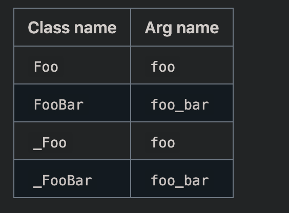

# basic dependency injection



```python
import pinject


class OutherClass:
    def __init__(self, inner_class, customize_inner_class):
        self.inner_class = inner_class
        self.customize_inner_class = customize_inner_class


class InnerClass:
    def __init__(self):
        self.forty_two = 42


class CustomizeInnerClass:
    def __init__(self):
        self.love = 'yang'


obj_graph = pinject.new_object_graph()
outer_class = obj_graph.provide(OutherClass)

print(outer_class.inner_class.forty_two)
print(outer_class.customize_inner_class.love)

```


# Finding classes and providers for implicit bindings
```python
class SomeClass(object):
    def __init__(self, foo):
        self.foo = foo


class Foo(object):
    pass

    def __call__(self, *args, **kwargs):
        return 'self'


obj_graph = pinject.new_object_graph(modules=None, classes=[SomeClass])
"""
The modules arg specifies in which (python) modules to look for classes; this defaults to ALL_IMPORTED_MODULES.
The classes arg specifies a exact list of classes; this defaults to None.
"""
# obj_graph.provide(SomeClass)  # would raise a NothingInjectableForArgError
obj_graph = pinject.new_object_graph(modules=None, classes=[SomeClass, Foo])
some_class = obj_graph.provide(SomeClass)
print(some_class.foo())
```

# Auto-copying args to fields

Pinject provides decorators that you can use to avoid repetitive initializer bodies.

- `@copy_args_to_internal_fields` prepends an underscore, i.e., it copies an arg named `foo` to a field named `_foo`. It's useful for normal classes.
- `@copy_args_to_public_fields` copies the arg named as-is, i.e., it copies an arg named `foo` to a field named `foo`. It's useful for data objects.

> These decorators can be applied to initializers that take `**kwargs` but not initializers that take `*pargs` (since it would be unclear what field name to use).

```java
import pinject


class ClassWithTediousInitializer(object):
    @pinject.copy_args_to_internal_fields
    def __init__(self, foo, bar, baz, quux):
        pass


cwti = ClassWithTediousInitializer('a-foo', 'a-bar', 'a-baz', 'a-quux')
print(cwti._foo)
>>> a-foo
```

